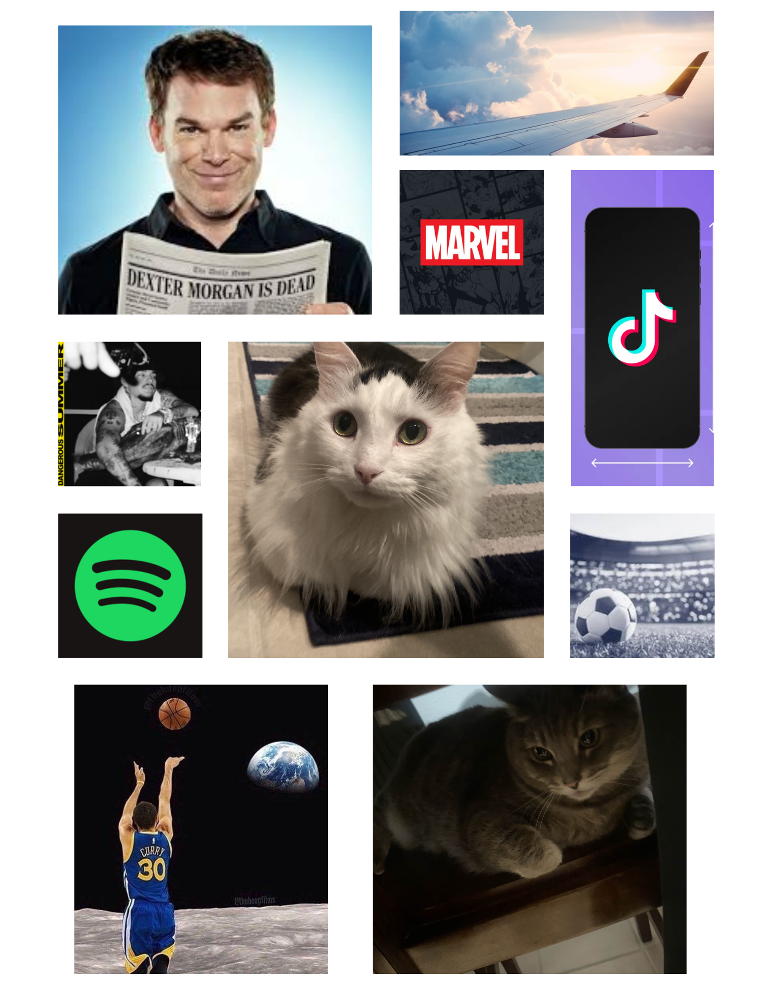

# me-in-markdown

## Introduction
My name is Gerard, Im in 10th grade and I like video games.

 My favorite movie would probably be Avengers Endgame because it was very long but there was a lot of action scenes I liked. My favorite scene was when Captain America was actually gonna try to fight all of Thanos and his army by himself and then all the other heroes come and use stranges portal to help him. I also liked how wanda could actually keep up with Thanos and was almost as strong as him by herself.

 I recently learned all of my new teachers names and remember where all of my new classes are. My goal for the year is to do all my work, have fun, and get straight A's. Im also happy I get most of my friends in all my classes except for math. In this Computer Science class, I hope to learn more about coding, vocabulary terms, and how to make better apps.
 
  My favorite foods that I ate this summer was ice cream, pizza, and burgers. My favorite kinda of pizza would definitely be Dominos because their crust and actual cheese is so good. I really like the stuffed crust because it makes it so much better. I really like In n Out burgers because they are really tasty. These are all special because they are all good and are amazing during hot weather like it was this summer. 

## Playlist
[Gersoap67's Playlist](https://open.spotify.com/playlist/3jrtrBOWm2rV69dv0HGcrt?si=whKgvyGVSSOdR6FhDTyJNA)

These are some of my favorite songs from summer!
## Image Collage
